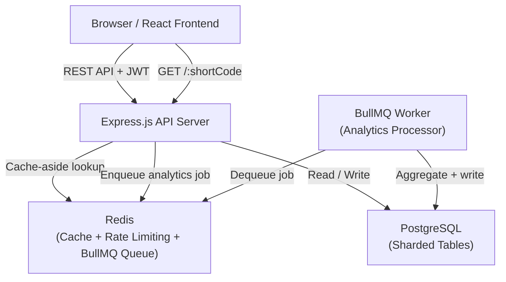
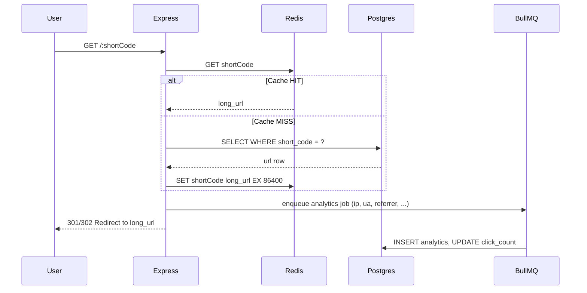

# Design: Scalable Distributed URL Shortener Platform

## Overview

This document describes the technical design for a production-grade URL shortening platform. The system enables authenticated users to create, manage, and analyze short URLs. It is built for horizontal scalability via Redis caching, logical database sharding, and asynchronous analytics processing through BullMQ.

### Key Design Goals

- **Low-latency redirection**: Sub-10ms response for cached short codes via Redis cache-aside pattern
- **Scalability**: Logical sharding simulation, background job queues, and stateless JWT auth support horizontal growth
- **Security**: bcrypt password hashing, JWT-protected routes, rate limiting, helmet headers, input validation
- **Observability**: Per-click analytics events with device, browser, OS, referrer, and geo data
- **Deployability**: Fully containerized via Docker Compose; deployable to Vercel + Render/Railway

---

## Architecture

### High-Level Architecture



### Request Flow: URL Redirection



### Deployment Architecture

```
Vercel (React SPA)
    │
    └── Render / Railway (Express.js API)
            │          │
        Supabase    Redis Cloud
       (Postgres)   (Upstash)
```

---

## Components and Interfaces

### 1. Authentication Module (`/api/auth`)

Handles user registration and login. Issues JWT tokens signed with a server secret.

**Responsibilities:**
- `POST /api/auth/register` — validate input, hash password with bcrypt (saltRounds=12), insert user, return 201
- `POST /api/auth/login` — verify credentials, sign JWT (24h expiry), return token
- `authMiddleware` — Express middleware that verifies `Authorization: Bearer <token>` on protected routes

**JWT Payload:**
```json
{ "userId": "uuid", "email": "user@example.com", "iat": ..., "exp": ... }
```

### 2. URL Management Module (`/api/urls`)

Handles creation, retrieval, update, and deletion of shortened URLs.

**Responsibilities:**
- Short code generation: Base62 alphabet (`0-9A-Za-z`), 6 characters, generated via nanoid or custom Base62 encoder
- Collision prevention: check uniqueness in DB before insertion; retry up to 5 times with new code
- Custom alias validation: check uniqueness + reserved keyword list
- Shard routing: determine target shard table by first character of short code
- Cache invalidation: on update/delete, call `redis.del(shortCode)`

**Reserved keywords list (minimum):**
```
api, login, register, dashboard, profile, admin, health, static, assets, favicon
```

### 3. Redirection Module (`GET /:shortCode`)

The hot path. Resolves short codes to long URLs with minimal overhead.

**Responsibilities:**
- Redis cache lookup first (cache-aside)
- PostgreSQL fallback with shard-aware query
- Enqueue BullMQ job for analytics (fire-and-forget, non-blocking)
- Respond with HTTP 302 (temporary redirect) to support analytics tracking; 301 would cache at browser level

### 4. Analytics Module (`/api/analytics`)

Handles reading aggregated analytics for a URL owner.

**Responsibilities:**
- Query analytics table for `url_id` belonging to authenticated user
- Aggregate: total clicks, unique IPs, daily trend (GROUP BY DATE), top referrers (GROUP BY referrer LIMIT 5), device breakdown
- Return structured JSON for frontend chart rendering

### 5. Cache Layer (Redis)

Centralized Redis instance serves three roles:
- **URL Cache**: key `url:{shortCode}` → `long_url`, TTL 86400s (24h)
- **Rate Limiter**: key `rl:{ip_or_userId}` → sliding window counter via `ioredis` + `express-rate-limit`
- **BullMQ Queue**: uses Redis Streams/Lists for job queuing

### 6. Background Job Worker (BullMQ)

A separate process (or same Node.js process in a separate worker file) consuming from the `analytics` queue.

**Job Payload:**
```json
{
  "urlId": "uuid",
  "shortCode": "aB3xYz",
  "ip": "1.2.3.4",
  "userAgent": "Mozilla/5.0 ...",
  "referrer": "https://google.com",
  "timestamp": "2024-01-01T00:00:00Z"
}
```

**Job Processing:**
1. Parse User-Agent string → browser, device type, OS (using `ua-parser-js`)
2. Optional: resolve IP → country (using `geoip-lite` or similar)
3. `INSERT INTO analytics (url_id, timestamp, ip_address, browser, device, os, referrer, country)`
4. `UPDATE urls SET click_count = click_count + 1 WHERE id = ?`

### 7. Database Sharding Simulation

Logical sharding via a routing function. All data lives in one PostgreSQL instance but is logically partitioned.

**Shard Router:**
```javascript
function getShard(shortCode) {
  const first = shortCode[0].toUpperCase();
  if (first >= 'A' && first <= 'F') return 'shard_1';
  if (first >= 'G' && first <= 'M') return 'shard_2';
  if (first >= 'N' && first <= 'S') return 'shard_3';
  return 'shard_4'; // T–Z and digits (0–9 map to shard_4 by default)
}
```

In a real distributed system, each shard key would map to a different DB connection. For this simulation, the shard key is stored in the `urls` table as metadata and can be used to simulate read-routing logic.

### 8. Rate Limiter

Uses `express-rate-limit` with a Redis store (`rate-limit-redis`) for distributed state.

- Window: 60 seconds
- Max: 100 requests
- Key: `userId` (authenticated) or `IP` (unauthenticated)
- Response on limit: `429 Too Many Requests` with `Retry-After` header

### 9. Frontend SPA (React.js)

Seven pages served as a client-side SPA via React Router v6.

| Page           | Component         | Data Source                    |
|----------------|-------------------|-------------------------------|
| Landing        | `LandingPage`     | Static                         |
| Login          | `LoginPage`       | `POST /api/auth/login`         |
| Register       | `RegisterPage`    | `POST /api/auth/register`      |
| Dashboard      | `DashboardPage`   | `GET /api/urls`                |
| URL Creation   | `CreateUrlPage`   | `POST /api/urls`               |
| Analytics      | `AnalyticsPage`   | `GET /api/analytics/:id`       |
| Profile        | `ProfilePage`     | Local JWT decode               |

JWT token stored in `localStorage`. Axios interceptor attaches `Authorization: Bearer <token>` to all authenticated requests.

---

## Data Models

### PostgreSQL Tables

#### `users`
```sql
CREATE TABLE users (
  id            SERIAL PRIMARY KEY,
  name          VARCHAR(100) NOT NULL,
  email         VARCHAR(255) NOT NULL UNIQUE,
  password_hash VARCHAR(255) NOT NULL,
  created_at    TIMESTAMP NOT NULL DEFAULT NOW()
);

CREATE INDEX idx_users_email ON users(email);
```

#### `urls`
```sql
CREATE TABLE urls (
  id            SERIAL PRIMARY KEY,
  short_code    VARCHAR(20)  NOT NULL UNIQUE,
  long_url      TEXT         NOT NULL,
  custom_alias  VARCHAR(50)  UNIQUE,
  user_id       INTEGER      NOT NULL REFERENCES users(id) ON DELETE CASCADE,
  click_count   INTEGER      NOT NULL DEFAULT 0,
  shard_key     VARCHAR(10)  NOT NULL,  -- shard_1 | shard_2 | shard_3 | shard_4
  created_at    TIMESTAMP    NOT NULL DEFAULT NOW(),
  expires_at    TIMESTAMP    NULL
);

CREATE INDEX idx_urls_short_code ON urls(short_code);
CREATE INDEX idx_urls_user_id    ON urls(user_id);
CREATE INDEX idx_urls_shard_key  ON urls(shard_key);
```

#### `analytics`
```sql
CREATE TABLE analytics (
  id          SERIAL PRIMARY KEY,
  url_id      INTEGER     NOT NULL REFERENCES urls(id) ON DELETE CASCADE,
  timestamp   TIMESTAMP   NOT NULL DEFAULT NOW(),
  ip_address  VARCHAR(45) NOT NULL,
  browser     VARCHAR(100),
  device      VARCHAR(20),   -- Desktop | Mobile | Tablet
  os          VARCHAR(100),
  referrer    VARCHAR(500),
  country     VARCHAR(100)
);

CREATE INDEX idx_analytics_url_id   ON analytics(url_id);
CREATE INDEX idx_analytics_timestamp ON analytics(timestamp);
```

### Redis Key Schema

| Key Pattern              | Value          | TTL      | Purpose                        |
|--------------------------|----------------|----------|-------------------------------|
| `url:{shortCode}`        | `long_url`     | 86400s   | URL redirect cache            |
| `rl:{ip}`                | counter (int)  | 60s      | Rate limit for unauthenticated |
| `rl:{userId}`            | counter (int)  | 60s      | Rate limit for authenticated  |
| `bull:analytics:{jobId}` | JSON job data  | managed  | BullMQ job queue              |

### API Request/Response Shapes

#### `POST /api/auth/register`
```json
// Request
{ "name": "Alice", "email": "alice@example.com", "password": "s3cur3pass" }

// Response 201
{ "message": "User registered successfully", "userId": 1 }
```

#### `POST /api/auth/login`
```json
// Request
{ "email": "alice@example.com", "password": "s3cur3pass" }

// Response 200
{ "token": "eyJhbGciOiJIUzI1NiIsInR5cCI6IkpXVCJ9..." }
```

#### `POST /api/urls`
```json
// Request
{ "longUrl": "https://example.com/very/long/path", "customAlias": "mylink" }

// Response 201
{
  "id": 42,
  "shortCode": "mylink",
  "shortUrl": "https://shortly.com/mylink",
  "longUrl": "https://example.com/very/long/path",
  "createdAt": "2024-01-01T00:00:00Z"
}
```

#### `GET /api/analytics/:id`
```json
// Response 200
{
  "urlId": 42,
  "totalClicks": 150,
  "uniqueVisitors": 98,
  "dailyTrends": [
    { "date": "2024-01-01", "clicks": 25 },
    { "date": "2024-01-02", "clicks": 40 }
  ],
  "topReferrers": [
    { "referrer": "https://google.com", "count": 60 }
  ],
  "deviceBreakdown": {
    "Desktop": 80,
    "Mobile": 60,
    "Tablet": 10
  }
}
```

---
## Correctness Properties

*A property is a characteristic or behavior that should hold true across all valid executions of a system — essentially, a formal statement about what the system should do. Properties serve as the bridge between human-readable specifications and machine-verifiable correctness guarantees.*

### Property 1: Email Validation Correctness

*For any* string input submitted as an email during registration, the system SHALL accept it if and only if it conforms to a valid email format (contains exactly one `@`, a valid local part, and a valid domain with TLD). Any string that does not conform SHALL be rejected with a validation error.

**Validates: Requirements 1.1**

---

### Property 2: Password Storage is Never Plaintext

*For any* plaintext password string used during registration, the stored `password_hash` value SHALL never equal the original plaintext string, AND `bcrypt.compare(plaintext, storedHash)` SHALL return `true`.

**Validates: Requirements 1.2**

---

### Property 3: Login Returns JWT If and Only If Credentials Are Valid

*For any* email/password pair, the login endpoint SHALL return a valid, decodable JWT token if the credentials match a registered user, AND SHALL return an error response (4xx) if the credentials are invalid (unregistered email, wrong password, or missing fields).

**Validates: Requirements 2.1**

---

### Property 4: Protected Endpoints Reject Requests Without Valid Token

*For any* protected API endpoint and any request that lacks a valid JWT token (absent, expired, or malformed), the system SHALL respond with HTTP 401 Unauthorized and SHALL NOT return any protected resource.

**Validates: Requirements 3.1**

---

### Property 5: Short Codes Contain Only Base62 Characters

*For any* auto-generated short code produced by the URL shortening engine, every character in the code SHALL be a member of the Base62 alphabet (`0–9`, `A–Z`, `a–z`), and the code SHALL be exactly 6 characters in length.

**Validates: Requirements 4.1**

---

### Property 6: Short Code Uniqueness Across Bulk Generation

*For any* batch of N short codes generated by the system (where N ≥ 2), the resulting set of codes SHALL contain no duplicates — i.e., all N codes SHALL be distinct strings.

**Validates: Requirements 4.2**

---

### Property 7: URL Format Validation Correctness

*For any* string submitted as a `longUrl`, the system SHALL accept it if and only if it is a well-formed URL (valid scheme such as `http://` or `https://`, a valid host, and optionally a path/query). Strings without a valid scheme, malformed hosts, or empty strings SHALL be rejected.

**Validates: Requirements 4.3**

---

### Property 8: Custom Alias Uniqueness Enforcement

*For any* custom alias string, if a URL already exists in the system with that alias, any subsequent attempt to create another URL with the same alias SHALL be rejected with an error response, and only one URL SHALL be associated with that alias at any time.

**Validates: Requirements 5.1**

---

### Property 9: Reserved Keywords Are Rejected as Custom Aliases

*For any* string that appears in the reserved keyword list (`api`, `login`, `register`, `dashboard`, `profile`, `admin`, `health`, `static`, `assets`, `favicon`), submitting it as a custom alias SHALL be rejected with an appropriate error, regardless of the requesting user.

**Validates: Requirements 5.2**

---

### Property 10: Non-Existent Short Codes Return 404

*For any* short code string that has not been registered in the system, a GET request to `/:shortCode` SHALL return an HTTP 404 response and SHALL NOT perform a redirect.

**Validates: Requirements 6.1**

---

### Property 11: Analytics Events Capture All Required Fields

*For any* redirect event triggered by a GET `/:shortCode` request, the resulting analytics record stored in the database SHALL contain non-null values for `url_id`, `timestamp`, `ip_address`, `browser`, `device`, and `referrer`. The `country` field MAY be null if geo-resolution is unavailable.

**Validates: Requirements 7.1**

---

### Property 12: Analytics Aggregation Correctness

*For any* known set of analytics records associated with a URL, the aggregation endpoint `GET /api/analytics/:id` SHALL return:
- `totalClicks` equal to the count of all records for that URL
- `uniqueVisitors` equal to the count of distinct `ip_address` values
- `deviceBreakdown` values that sum to `totalClicks`
- `dailyTrends` entries that collectively sum to `totalClicks`

**Validates: Requirements 7.2**

---

### Property 13: Cache Invalidation on URL Modification

*For any* URL whose `short_code` is currently cached in Redis, performing an update or delete operation on that URL SHALL result in the Redis key `url:{shortCode}` being removed (cache miss on next lookup), ensuring stale data is never served after modification.

**Validates: Requirements 8.1**

---

### Property 14: Shard Router Determinism and Correctness

*For any* short code string, the `getShard` function SHALL return a deterministic shard identifier (`shard_1` through `shard_4`) based solely on the first character of the code, with the mapping: `A–F → shard_1`, `G–M → shard_2`, `N–S → shard_3`, `T–Z and digits → shard_4`. The same input SHALL always produce the same shard output.

**Validates: Requirements 9.1, 9.2**

---

### Property 15: Rate Limiter Blocks at Threshold

*For any* user/IP identity, after exactly 100 requests within a 60-second window, the 101st request SHALL receive an HTTP 429 Too Many Requests response. Requests 1–100 within the same window SHALL succeed (not be blocked by the rate limiter).

**Validates: Requirements 10.1**

---

## Error Handling

### Strategy

All errors follow a consistent JSON response envelope:

```json
{
  "error": "Short description",
  "message": "Human-readable explanation",
  "statusCode": 400
}
```

### Error Catalog

| Scenario                           | HTTP Status | Error Code               |
|------------------------------------|-------------|--------------------------|
| Invalid email format               | 400         | `VALIDATION_ERROR`       |
| Invalid URL format                 | 400         | `INVALID_URL`            |
| Duplicate email on register        | 409         | `EMAIL_ALREADY_EXISTS`   |
| Duplicate custom alias             | 409         | `ALIAS_ALREADY_EXISTS`   |
| Reserved keyword as alias          | 400         | `RESERVED_KEYWORD`       |
| Wrong login credentials            | 401         | `INVALID_CREDENTIALS`    |
| Missing or expired JWT             | 401         | `UNAUTHORIZED`           |
| Short code not found               | 404         | `SHORT_CODE_NOT_FOUND`   |
| URL not found / not owned by user  | 404         | `NOT_FOUND`              |
| Rate limit exceeded                | 429         | `RATE_LIMIT_EXCEEDED`    |
| Short code collision (max retries) | 500         | `CODE_GENERATION_FAILED` |
| Unexpected server error            | 500         | `INTERNAL_ERROR`         |

### Collision Retry Logic

Short code generation retries up to 5 times before returning `CODE_GENERATION_FAILED`. Each retry generates a fresh random code. In practice, collision probability for a 6-char Base62 code is negligible until ~1 billion URLs, so retries are a safety net.

### BullMQ Job Failure Handling

Analytics jobs that fail (e.g., DB unavailable) are retried up to 3 times with exponential backoff. After max retries, the job moves to the `failed` queue and is logged. This ensures analytics processing does not affect the hot redirect path — failures are isolated.

---

## Testing Strategy

### Approach

This feature uses a **dual testing approach**: example-based unit tests for specific scenarios and integration tests for infrastructure wiring. Property-based testing (PBT) is applied to the pure logic functions where universal properties hold across a large input space.

**PBT Library**: [fast-check](https://github.com/dubzzz/fast-check) (JavaScript/TypeScript, runs in Node.js)

### Unit Tests

Focus on specific examples and edge cases:

- Auth: register/login happy paths, duplicate email, missing fields
- URL creation: happy path, custom alias conflicts, reserved keywords
- Redirect: 301/302 response, 404 for unknown codes
- Analytics: aggregation with known data
- Shard router: boundary characters (A, F, G, M, N, S, T, Z, digits)

### Property-Based Tests (fast-check, minimum 100 iterations each)

Each test references its design document property via a tag comment:

```javascript
// Feature: url-shortener, Property 1: Email validation correctness
```

| Property | What varies | Assertion |
|----------|-------------|-----------|
| P1: Email validation | Arbitrary strings | validator(x) === isValidEmail(x) |
| P2: Password never plaintext | Any string password | hash !== plain AND bcrypt.compare(plain, hash) |
| P3: Login JWT iff valid creds | Registered vs unregistered creds | 200+JWT vs 401 |
| P4: Protected routes → 401 | All protected endpoints, no token | Always 401 |
| P5: Base62 short codes | N generated codes | All chars in [0-9A-Za-z], length === 6 |
| P6: Short code uniqueness | Batch of N codes | Set(codes).size === N |
| P7: URL format validation | Arbitrary strings | validator(x) === isValidUrl(x) |
| P8: Custom alias uniqueness | Any alias string | Second creation fails |
| P9: Reserved keywords rejected | Any reserved keyword | Always rejected |
| P10: 404 for unknown codes | Random non-existent codes | Always 404 |
| P11: Analytics field completeness | Varied IP/UA/referrer | All required fields present |
| P12: Analytics aggregation | Known data distributions | Sums and counts correct |
| P13: Cache invalidation | Any cached URL | Redis key absent after update/delete |
| P14: Shard router determinism | Any short code string | Correct shard, same input → same output |
| P15: Rate limiter threshold | 100+N requests per identity | First 100 pass, 101+ → 429 |

### Integration Tests

Verify the full stack with real Redis and PostgreSQL (Docker Compose test environment):

- Cache-aside hit/miss flow (REQ-CACHE-1)
- BullMQ job enqueue and consumption
- End-to-end redirect with analytics persisted
- Rate limiting in multi-request scenarios

### Test Configuration

- **Property tests**: minimum **100 iterations** per test (`fc.assert(fc.property(...), { numRuns: 100 })`)
- **Integration tests**: run against `docker compose -f docker-compose.test.yml up`
- **Coverage target**: 80%+ for business logic modules (auth, URL engine, shard router, analytics aggregator)
